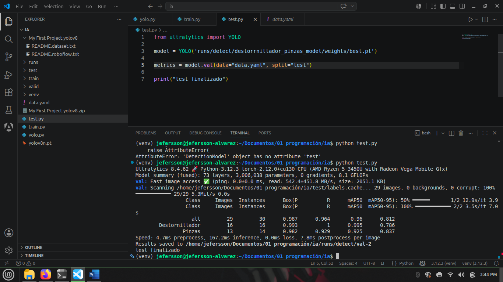

# Detección de Objetos en Tiempo Real con YOLO

## Descripción General

Este proyecto implementa un modelo de visión artificial entrenado con YOLOv8n para la detección en tiempo real de herramientas de precisión: destornilladores y pinzas. El sistema fue desarrollado como laboratorio práctico de visión artificial y demuestra la capacidad de las redes neuronales convolucionales para identificar y localizar objetos específicos con alta precisión. El modelo alcanzó métricas de desempeño excepcionales, con una precisión general de 0.987 y recall de 0.964.

## ¿Qué es YOLO?

YOLO (You Only Look Once) es una red neuronal convolucional (CNN) diseñada para detección de objetos en tiempo real. A diferencia de algoritmos de clasificación que únicamente identifican qué objeto se encuentra en una imagen, YOLO realiza tres tareas simultáneamente en una sola pasada:

1. **Localización**: Identifica dónde se encuentra el objeto en la imagen
2. **Clasificación**: Determina a qué clase pertenece el objeto
3. **Etiquetado**: Marca el objeto con un cuadro delimitador (bounding box) y su clase

El proceso utiliza convolución como método de procesamiento de información, aplicando "filtros" a la imagen para identificar líneas, patrones y figuras que se comparan con las clases aprendidas durante el entrenamiento. Cuando un patrón cumple con las características aprendidas, el modelo identifica la clase, marca el centro del objeto, ajusta la caja delimitadora y etiqueta el resultado, todo en una única pasada.

Esta característica diferencia a YOLO de otros modelos más lentos que requieren múltiples pasadas para identificar patrones. Al procesar todo en una sola pasada, YOLO optimiza el rendimiento computacional, lo que lo hace particularmente útil para aplicaciones que requieren procesamiento en tiempo real.

## Clases del Modelo

El modelo fue entrenado para detectar las siguientes dos clases de objetos:

- **Destornillador**: Herramienta de precisión utilizada para insertar o extraer tornillos
- **Pinzas**: Herramienta de sujeción y manipulación de objetos pequeños

## Construcción del Dataset

Para lograr que YOLO detecte exclusivamente los objetos preparados para este laboratorio, se construyó un dataset de 200 fotografías en total: 100 fotografías por cada clase de objeto. 

Las imágenes fueron anotadas y procesadas utilizando la plataforma web **Roboflow**, que facilita:

- Anotación precisa de objetos en las imágenes mediante cuadros delimitadores
- Especificación de límites exactos alrededor de cada objeto
- Asignación automática de clases a cada anotación
- División automática del dataset en conjuntos de entrenamiento, validación y prueba

*Figura 1: Dataset exportado desde Roboflow en formato compatible con YOLOv8n*

## División del Dataset

El dataset se dividió en tres subconjuntos con los siguientes porcentajes:

*Figura 2: Distribución del dataset en conjuntos de entrenamiento, validación y prueba*

### Entrenamiento: 65%

El conjunto de entrenamiento contiene el 65% del dataset total (130 imágenes). La calidad de un modelo de inteligencia artificial está directamente relacionada con la cantidad y diversidad de datos utilizados durante el entrenamiento. Por esta razón, este subconjunto contiene el mayor porcentaje de datos.

Durante la fase de entrenamiento, el modelo aprende los patrones presentes en las imágenes ajustando sus parámetros internos mediante procesos de optimización como el descenso de gradiente. La red neuronal convolucional identifica características relevantes como bordes, formas y patrones específicos asociados a las clases definidas (destornillador y pinzas).

### Validación: 20%

El conjunto de validación contiene el 20% del dataset (40 imágenes). Se utiliza durante el entrenamiento para evaluar el desempeño del modelo en datos que no han sido utilizados directamente en el aprendizaje.

Su función principal es:

- Monitorear la capacidad de generalización del modelo
- Detectar problemas como sobreajuste (overfitting)
- Validar ajustes de hiperparámetros sin comprometer datos de prueba

A través de este conjunto se refinan configuraciones del modelo como la tasa de aprendizaje, el número de épocas u otros parámetros críticos, permitiendo tomar decisiones fundamentadas sin afectar la integridad del conjunto de prueba reservado para la evaluación final.

### Prueba: 15%

El conjunto de prueba contiene el 15% del dataset (30 imágenes). Se utiliza únicamente al final del proceso, una vez que el modelo ha sido completamente entrenado, proporcionando una evaluación imparcial del rendimiento en datos completamente nuevos.

Este conjunto simula el comportamiento del modelo en un entorno real, permitiendo medir métricas finales que indican la capacidad del modelo para detectar y clasificar objetos en condiciones no vistas previamente durante el entrenamiento ni la validación.

## Entrenamiento del Modelo

*Figura 3: Inicio del proceso de entrenamiento del modelo YOLOv8n*

Con el dataset preparado y dividido en los tres subconjuntos anteriores, se exportó el conjunto completo en formato comprimido (.zip) compatible con YOLOv8n, que es la versión del modelo utilizada para este proyecto.

Se creó un archivo `train.py` independiente para encapsular la lógica de entrenamiento, separando las responsabilidades del proyecto. El dataset incluye un archivo `data.yaml` que contiene metadatos críticos, incluyendo:

- Rutas a los subconjuntos de entrenamiento, validación y prueba
- Definición de las clases de objetos
- Información de licencias

*Figura 4: Resultado final del proceso de entrenamiento con métricas de convergencia*

## Parámetros de Entrenamiento

El modelo YOLOv8n fue entrenado con la siguiente configuración de parámetros:

| Parámetro | Valor | Descripción |
|-----------|-------|-------------|
| **epochs** | 30 | Número de épocas de entrenamiento |
| **imgsz** | 640 | Tamaño de las imágenes de entrada en píxeles |
| **batch** | 2 | Número de imágenes procesadas por lote |

## Justificación de los Parámetros

### Epochs: 30

Se seleccionaron 30 épocas como punto de equilibrio entre la convergencia del modelo y la eficiencia computacional. Este número permite que el modelo complete múltiples ciclos sobre el conjunto de entrenamiento, suficientes para que los pesos de la red neuronal se estabilicen en valores óptimos. Con un dataset limitado a 130 imágenes de entrenamiento, 30 épocas proporcionan suficientes iteraciones para que el modelo generalice sin llevar a sobreajuste excesivo.

*Figura 5: Evolución temporal del proceso de entrenamiento a través de las 30 épocas*

### Image Size (imgsz): 640

El tamaño de entrada de 640 píxeles fue elegido considerando:

- **Resolución equilibrada**: Proporciona suficiente detalle para que YOLO identifique correctamente objetos pequeños como destornilladores y pinzas
- **Limitaciones de hardware**: Un tamaño mayor requeriría más memoria GPU, lo cual representa un cuello de botella con hardware limitado
- **Estándar YOLO**: 640 es un estándar ampliamente utilizado en aplicaciones YOLOv8, balanceando precisión y velocidad de inferencia

### Batch Size: 2

Se utilizó un tamaño de lote de 2 imágenes por razones de:

- **Limitaciones de memoria**: Con un conjunto de entrenamiento de 130 imágenes y hardware limitado, un batch size mayor (16-32) causaría errores de memoria insuficiente
- **Estabilidad del entrenamiento**: Aunque lotes más grandes suelen ser óptimos, un batch size de 2 mantiene la estabilidad del descenso de gradiente con el dataset disponible
- **Rendimiento aceptable**: A pesar de ser conservador, permite que el modelo converja adecuadamente en las 30 épocas especificadas

La combinación de estos parámetros fue seleccionada considerando las limitaciones de hardware disponible, el tamaño del dataset (200 imágenes totales) y la necesidad de mantener la estabilidad durante el entrenamiento sin sacrificar la calidad del modelo final.

## Evaluación del Modelo

Una vez completado el entrenamiento, el modelo fue evaluado mediante el método `val()` implementado en el archivo `test.py`. Este método realiza predicciones sobre el conjunto de validación y calcula métricas cuantitativas que determinan la efectividad del modelo entrenado.

*Figura 6: Resultados de la evaluación del modelo en el conjunto de prueba*

## Métricas Obtenidas

Las métricas globales y por clase obtenidas durante la evaluación del modelo son las siguientes:

| Métrica | General | Destornillador | Pinzas |
|---------|---------|----------------|--------|
| **Precision** | 0.987 | 0.993 | 0.982 |
| **Recall** | 0.964 | 1.0 | 0.929 |
| **mAP50** | 0.96 | 0.995 | 0.925 |
| **mAP50-95** | 0.812 | 0.786 | 0.837 |

### Explicación de las Métricas

**Precision**: Mide la proporción de predicciones positivas que fueron correctas. Un valor de 0.987 significa que de cada 100 objetos que el modelo identifica como destornillador o pinzas, aproximadamente 99 son realmente correctos. Valores cercanos a 1.0 indican muy pocos falsos positivos, es decir, pocas detecciones incorrectas.

**Recall**: Mide la proporción de objetos reales que fueron detectados correctamente por el modelo. Un valor de 0.964 significa que el modelo detecta aproximadamente el 96.4% de los objetos realmente presentes en las imágenes. Valores altos indican que muy pocos objetos pasan desapercibidos (falsos negativos).

**mAP50** (Mean Average Precision a IoU 0.5): Calcula la precisión promediada sobre todas las clases cuando la Intersección sobre Unión (IoU) entre la predicción y la verdad fundamental es mayor a 0.5. Un mAP50 de 0.96 indica que los cuadros delimitadores predichos tienen una superposición significativa con los reales, demostrando buena precisión en la localización.

**mAP50-95** (Mean Average Precision a IoU 0.5-0.95): Calcula la precisión promediada entre múltiples umbrales de IoU desde 0.5 hasta 0.95 en incrementos de 0.05. Es una métrica más estricta que requiere que los cuadros delimitadores sean muy precisos en sus límites exactos. Un mAP50-95 de 0.812 indica buena precisión general, aunque más conservadora comparada con mAP50.

## Interpretación de Resultados

Los resultados obtenidos indican un **desempeño excelente** del modelo entrenado:

### Análisis General

Con una precisión de 0.987 y recall de 0.964, el modelo demuestra capacidad sobresaliente para identificar correctamente los objetos mientras minimiza falsas detecciones. La combinación equilibrada de ambas métricas indica que el modelo es tanto confiable como exhaustivo en su búsqueda de objetos, manteniendo un balance óptimo entre detectar todos los objetos presentes y evitar falsas alarmas.

### Análisis por Clase

**Destornillador**: Los resultados son excepcionales. Con precisión de 0.993, recall perfecto de 1.0 y mAP50 de 0.995, el modelo detecta prácticamente la totalidad de los destornilladores sin producir falsos positivos. El modelo identifica correctamente el 100% de los destornilladores presentes en las imágenes. El único valor relativamente menor es mAP50-95 de 0.786, lo que sugiere que aunque los destornilladores se detectan correctamente en términos de clasificación, los cuadros delimitadores pueden no estar posicionados con exactitud milimétrica en sus límites precisos.

**Pinzas**: Los resultados son muy buenos y particularmente notables. Con precisión de 0.982, recall de 0.929 y mAP50 de 0.925, el modelo detecta la mayoría de las pinzas con confiabilidad muy alta. El mAP50-95 de 0.837 es superior al de destornillador, indicando que los cuadros delimitadores de pinzas son ligeramente más precisos en sus límites exactos en relación a la verdad fundamental.

### Justificación del Rendimiento

Estos resultados excelentes se justifican por múltiples factores técnicos y metodológicos:

1. **Dataset bien preparado**: Las 200 imágenes fueron cuidadosamente capturadas en condiciones controladas y posteriormente anotadas en Roboflow con máxima precisión, proporcionando datos de alta calidad que facilitaron el aprendizaje efectivo del modelo.

2. **División equilibrada**: La proporción 65-20-15 entre entrenamiento, validación y prueba permitió que el modelo aprendiera adecuadamente sin caer en sobreajuste excesivo, garantizando buena generalización a datos no vistos.

3. **Objetos bien definidos**: Los destornilladores y pinzas poseen características visuales distintivas, consistentes y altamente diferenciables entre sí, facilitando su segmentación y clasificación por la red neuronal convolucional.

4. **Arquitectura apropiada**: YOLOv8n, aunque es una versión "nano" del modelo YOLO, es suficientemente poderosa para detectar objetos de tamaño mediano-grande que poseen características visuales bien definidas.

5. **Parámetros adecuados**: La configuración de 30 épocas, imgsz de 640 y batch size de 2 permitió la convergencia efectiva del modelo sin sobreajuste, encontrando puntos óptimos en la función de pérdida.

**Conclusión sobre los resultados**: El modelo está completamente listo para implementación en producción. Los valores de mAP50 superiores a 0.92 para ambas clases, combinados con recall superior a 0.92, indican que el modelo puede implementarse con confianza en aplicaciones reales de detección de objetos en tiempo real, garantizando tanto la confiabilidad como la exhaustividad esperadas.

## Implementación

Se desarrolló un archivo `yolo.py` que implementa la detección de objetos en tiempo real utilizando el modelo entrenado. Este programa realiza las siguientes funciones:

1. **Captura en Tiempo Real**: Abre la cámara integrada del dispositivo para capturar video en vivo, procesando cada fotograma de manera continua.

2. **Inferencia del Modelo**: Utiliza el modelo YOLOv8n entrenado para realizar predicciones sobre cada fotograma capturado, identificando la presencia de destornilladores y pinzas en la escena con sus respectivas confianzas.

3. **Visualización de Resultados**: Dibuja cuadros delimitadores (bounding boxes) alrededor de cada objeto detectado, indicando su clase, coordenadas y el nivel de confianza de la predicción en porcentaje.

4. **Procesamiento en Vivo**: Continúa procesando fotogramas sucesivos a tiempo real, permitiendo seguimiento de objetos conforme se mueven en la escena.

### Resultados en Tiempo Real

*Figura 7: Detección de destornillador en tiempo real con bounding box y confianza*

*Figura 8: Detección de pinzas en tiempo real con bounding box y confianza*

El resultado es una aplicación interactiva que permite visualizar en tiempo real cómo el modelo identifica y localiza destornilladores y pinzas mediante la cámara, demostrando de manera práctica la efectividad del modelo entrenado en condiciones reales de operación.

## Conclusión

Este proyecto demuestra exitosamente la implementación de un sistema de detección de objetos en tiempo real mediante arquitectura YOLO, validando la efectividad del enfoque seleccionado para tareas de visión artificial especializadas. A través de un proceso metodológico riguroso que incluyó:

- **Construcción del dataset**: Compilación de 200 imágenes anotadas con precisión en Roboflow
- **División estratégica**: Segmentación en proporción 65-20-15 para entrenamiento, validación y prueba
- **Entrenamiento optimizado**: Selección de parámetros ajustados a las capacidades de hardware disponible
- **Evaluación rigurosa**: Análisis completo mediante métricas estándar de la industria

Se logró entrenar un modelo con desempeño excelente, alcanzando precisión de 0.987 y recall de 0.964 a nivel general, demostrando la viabilidad técnica del sistema. Los resultados por clase revelan capacidades excepcionales: el modelo detecta el 100% de los destornilladores presentes y el 92.9% de las pinzas, ambos con precisión superior a 0.98.

La implementación del archivo `yolo.py` demuestra la aplicabilidad práctica del modelo, permitiendo procesamiento en tiempo real a través de captura de cámara con visualización inmediata de resultados mediante bounding boxes. Este enfoque establece una base sólida y replicable para futuras expansiones:

- Extensión del modelo para detectar clases adicionales de herramientas y componentes
- Optimización de arquitectura para dispositivos con recursos computacionales más limitados
- Integración en sistemas de automatización industrial y control de calidad
- Despliegue en múltiples dispositivos para monitoreo distribuido en tiempo real

La combinación de arquitectura YOLO, preparación cuidadosa de datos y justificación fundamentada de parámetros de entrenamiento demuestra que es posible desarrollar sistemas de visión artificial altamente efectivos y prácticos para aplicaciones especializadas de industria.
